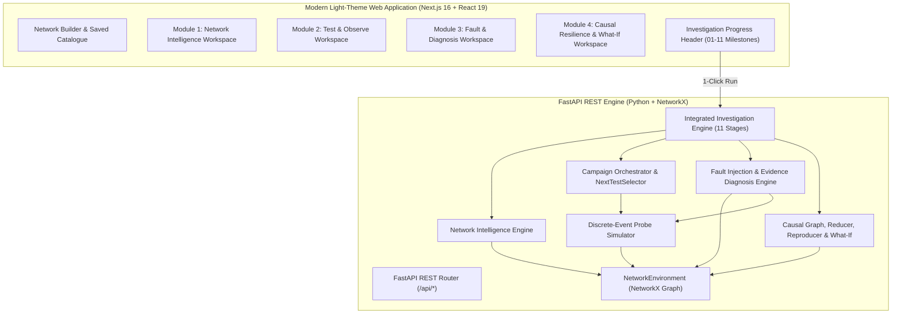

# Intelligent Network Resilience Testing & Failure Investigation Platform
### *Failure-Signature and Causal-Dependency Guided Network Failure Testing, Reduction, and Reproduction System*
**Repository:** `Design-and-Development-of-an-Interactive-Web-Based-Routing-Simulator-for-RIP-OSPF-and-BGP`

---

## 1. Executive Summary & Vision

The **Intelligent Network Resilience Testing & Failure Investigation Platform** is an end-to-end Computer Networks experimentation framework that systematically models network topologies, discovers routing paths, orchestrates targeted health testing campaigns, injects controlled reversible faults, isolates root causes through empirical telemetry (without ground-truth peeking), and validates resilience through causal dependency graphs, topology reduction, and multi-trial reproduction.

Built with **FastAPI**, **NetworkX**, **Python**, **Next.js 16 (Turbopack)**, **React 19**, and **TypeScript**, the platform delivers mathematical determinism, transparent telemetry, and a modular architecture.

```text
BUILD / LOAD TOPOLOGY
        ↓
MODULE 1: NETWORK INTELLIGENCE (Forwarding Paths, Reachability Matrix, Component Dependencies)
        ↓
MODULE 2: INTELLIGENT TESTING (Test Campaigns, Probes, Deterministic Rule Selector)
        ↓
MODULE 3: FAULT & DIAGNOSIS (Controlled Injection, Telemetry, Localization, Hypotheses, Blast Radius)
        ↓
MODULE 4: CAUSAL RESILIENCE (Failure Signature, Causal Graph, Reduction 7➔5, Reproduction 3/3, What-If)
        ↓
AUDIT & HISTORY (Chronological Run Records, Detailed Stage Inspection, JSON Export)
```

---

## 2. Four-Member Academic Module Ownership Matrix

Designed for collaborative engineering and distinct Computer Networks specializations:

| Member | Module | Core Question | Responsibilities & Implemented Algorithms |
| :--- | :--- | :--- | :--- |
| **Member 1** | **Module 1: Network Intelligence** | *"What paths exist and how does traffic move?"* | Deterministic shortest path routing (`DeterministicShortestPathStrategy`), loop-free alternate path enumeration, all-pairs reachability matrix ($N \times N$), topological path comparison, and cut-edge bottleneck flow dependencies. |
| **Member 2** | **Module 2: Intelligent Testing** | *"What should we test next?"* | Test library (`NetworkTestLibrary`), stateful test campaigns, explainable next-test selection logic (`NextTestSelector`), discrete-event packet probe simulator (`ProbeSimulator`), and structured failure handoffs. |
| **Member 3** | **Module 3: Fault & Diagnosis** | *"What went wrong and where?"* | Reversible fault injection (`FaultInjectionEngine`: link, node, interface), empirical probe telemetry observation (`FailureObservationEngine`), drop transition boundary localization (`FailureLocalizationEngine`), competing hypothesis scoring (`HypothesisEngine`), and blast radius impact analysis (`ImpactAnalysisEngine`). |
| **Member 4** | **Module 4: Causal Resilience** | *"Why did it happen, what was essential, and can we reproduce it?"* | Structured failure signature (`FailureSignatureGenerator`), directed causal dependency graph (`CausalDependencyGenerator`), dependency-preserving reduction (`DependencyAwareReducer`), multi-trial reproduction validation (`FailureReproducer`), sandboxed What-If prospective simulation (`WhatIfResilienceEngine`), and master orchestrator (`IntegratedInvestigationEngine`). |

---

## 3. System Architecture



---

## 4. Canonical Demonstration Network Benchmark

The canonical 7-node, 6-link topology is the baseline for all tests and demos:

```text
PC1 (Host) —— R1 (Router) —— R2 (Router) —— R3 (Router) —— Server (Host)
                                  |
                              R4 (Router)
                                  |
                              PC2 (Host)
```

### Empirical Test Matrix
| Stage / Condition | Target Flow | Packets (Sent/Recv) | Loss % | Reachability | Empirical Observation |
| :--- | :--- | :--- | :--- | :--- | :--- |
| **1. Baseline Health** | `PC1 ➔ Server` | 3 / 3 | **0.0%** | `REACHABLE` | Forwarding path `PC1-R1-R2-R3-Server` intact (4 hops) |
| **2. Independent Subnet** | `PC1 ➔ PC2` | 3 / 3 | **0.0%** | `REACHABLE` | Forwarding path `PC1-R1-R2-R4-PC2` intact (4 hops) |
| **3. Fault Injection (`R2-R3` DOWN)** | `PC1 ➔ Server` | 3 / 0 | **100.0%** | `UNREACHABLE` | Packets drop at `R2`; link `R2-R3` severed; 0 alternate bypass paths |
| **4. Subnet Isolation Verification** | `PC1 ➔ PC2` | 3 / 3 | **0.0%** | `REACHABLE` | Independent branch operates with 0% loss during core link failure |
| **5. Evidence Diagnosis** | `PC1 ➔ Server` | Telemetry scored | N/A | `DIAGNOSED` | Primary cause: `LINK_FAILURE` on `R2-R3` (High Confidence) |
| **6. Dependency-Aware Reduction** | `PC2, R4, R1` | Graph pruning | N/A | `PRESERVED` | `PC2` & `R4` safely pruned; transit `R1` retained ➔ **5 nodes, 4 links** |
| **7. Multi-Trial Reproduction** | `3 Trials on Reduced` | 9 / 0 total | **100.0%** | `UNREACHABLE` | **3/3 runs** match failure signature and causal graph identically |
| **8. Fault Restoration** | `PC1 ➔ Server` | 3 / 3 | **0.0%** | `REACHABLE` | Link `R2-R3` restored to UP; 0% loss; healthy recovery verified |

---

## 5. Strict Network State Disambiguation

The platform strictly avoids conflating network concepts:
- **Node Health**: `UP` / `DOWN` / `UNKNOWN`
- **Link Operational State**: `UP` / `DOWN` / `UNKNOWN`
- **Flow Reachability**: `REACHABLE` / `UNREACHABLE`

> **Real-World Principle:** A link failure on `R2-R3` leaves Router `R2` **UP** and Router `R3` **UP**, but sets Link `R2-R3` to **DOWN**. The flow `PC1 ➔ Server` becomes **UNREACHABLE**, while the flow `PC1 ➔ PC2` remains fully **REACHABLE**.

---

## 6. Technology Stack

- **Backend**:
  - Python 3.14+
  - FastAPI (High-performance ASGI web framework)
  - NetworkX (Graph data structures, shortest path algorithms, snapshot sandboxing)
  - Pydantic v2 (Strict data models and API schemas)
  - Uvicorn (ASGI production server)
  - Pytest (Comprehensive unit, integration, and scenario testing)
- **Frontend**:
  - Next.js 16 (App Router, Turbopack)
  - React 19 (Server/Client components, Hooks, Context API)
  - TypeScript (Full static type verification)
  - Tailwind CSS (Curated light theme, responsive layouts)

---

## 7. Getting Started

### Prerequisites
- Python 3.10+ (tested through 3.14)
- Node.js 18+ and npm

### 1. Start the Backend API
```powershell
cd backend
python -m venv .venv
.\.venv\Scripts\Activate.ps1
pip install -r requirements.txt
uvicorn main:app --host 127.0.0.1 --port 8000 --reload
```
API Documentation will be live at: `http://127.0.0.1:8000/docs`

### 2. Start the Frontend Dashboard
```powershell
cd frontend
npm install
npm run dev
```
Open your browser at: `http://localhost:3000`

---

## 8. Running the Complete Test Suite

### Backend Pytest Suite (123 Tests)
```powershell
cd backend
.\.venv\Scripts\pytest -v
```
**Results:** `123 passed, 0 failed in 4.99s` across 12 test modules:
- `tests/test_topology.py` (14 tests)
- `tests/test_simulation.py` (8 tests)
- `tests/test_intelligence.py` (18 tests)
- `tests/test_orchestration.py` (22 tests)
- `tests/test_diagnosis.py` (17 tests)
- `tests/test_reduction.py` (10 tests)
- `tests/test_reproduction.py` (10 tests)
- `tests/test_causal_resilience.py` (10 tests)
- `tests/test_demo_scenario.py` (1 test)
- `tests/test_experiment.py` (5 tests)
- `tests/test_causal.py` (4 tests)
- `tests/test_failure.py` (4 tests)

### Frontend Production Build Verification
```powershell
cd frontend
npm run build
```
**Results:** Compiled clean in ~4.3s with Next.js Turbopack and 0 TypeScript errors.

### Live End-to-End API Verification
```powershell
cd backend
python verify_phase10d_e2e.py
```
**Results:** All 11 pipeline stages, What-If prospective simulation, and history persistence verified live.

---

## 9. API Reference Summary

| Method | Endpoint | Description |
| :--- | :--- | :--- |
| `GET` | `/api/health` | Service health status check |
| `GET` | `/api/topology` | Retrieve active topology data (nodes & links) |
| `POST`| `/api/topology/reset` | Reset topology and restore all faults to baseline |
| `GET` | `/api/network-intelligence/path` | Compute active forwarding path and hop distance |
| `GET` | `/api/network-intelligence/reachability` | Generate all-pairs endpoint reachability matrix |
| `GET` | `/api/network-intelligence/dependencies` | Invert path graph for component-to-flow dependencies |
| `POST`| `/api/orchestration/campaigns` | Initialize a new stateful test campaign |
| `POST`| `/api/orchestration/campaigns/{id}/step`| Execute the next system-selected network test |
| `POST`| `/api/faults/inject` | Controlled injection of link, node, or interface fault |
| `POST`| `/api/faults/restore` | Reversibly restore specific or all active faults |
| `POST`| `/api/diagnosis/diagnose` | Perform evidence-based hypothesis scoring & diagnosis |
| `POST`| `/api/diagnosis/impact` | Compute blast radius impact report |
| `GET` | `/api/failure-signature` | Retrieve structured failure fingerprint |
| `GET` | `/api/causal-dependencies` | Retrieve directed causal graph |
| `POST`| `/api/reduction/run` | Execute dependency-preserving failure reduction (7➔5) |
| `POST`| `/api/reproduction/run` | Execute multi-trial deterministic reproduction (3 runs) |
| `POST`| `/api/resilience/what-if` | Non-destructive prospective failure impact simulation |
| `POST`| `/api/investigation/run` | Master 1-click execution of the full 11-stage pipeline |
| `GET` | `/api/investigation/history` | Chronological audit log of completed investigations |

---

## 10. Theoretical Bounds & Non-Goals

1. **Deterministic Simulation Framework**: Employs NetworkX discrete-event graph models rather than kernel-level Mininet namespaces or hardware routers.
2. **Explainable Algorithmic Logic**: Replaces opaque machine-learning / LLM guessing with transparent, deterministic Computer Networks rules.
3. **Failure-Preserving Minimality**: Guarantees preservation of the target failure signature and causal dependencies (pruning `PC2` and `R4` while preserving `R1`); does not claim global NP-complete minimal subgraph generation.
